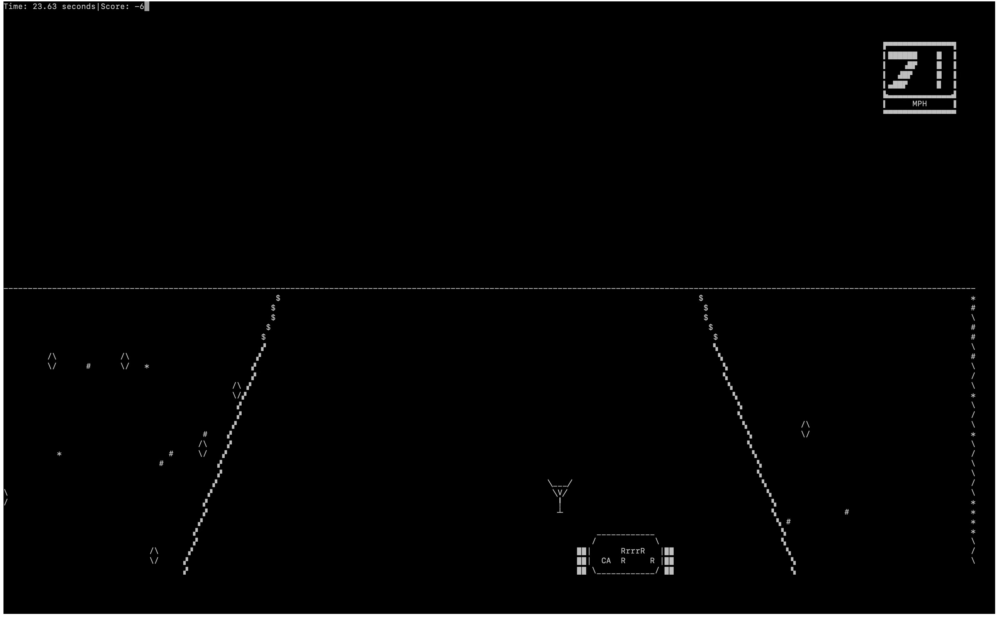
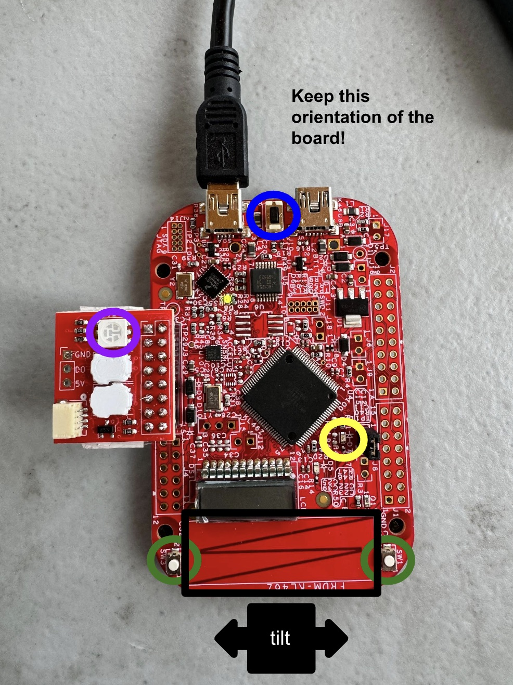
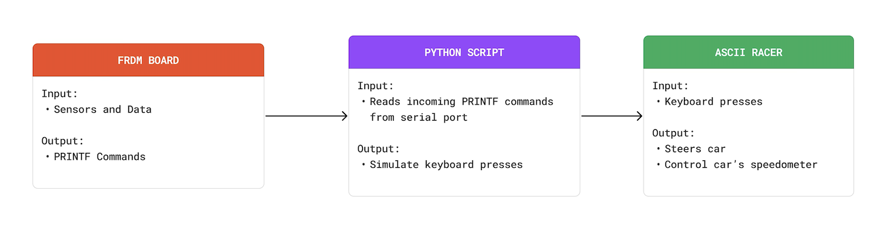
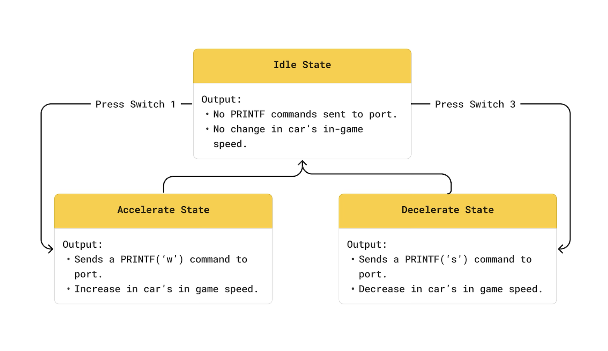
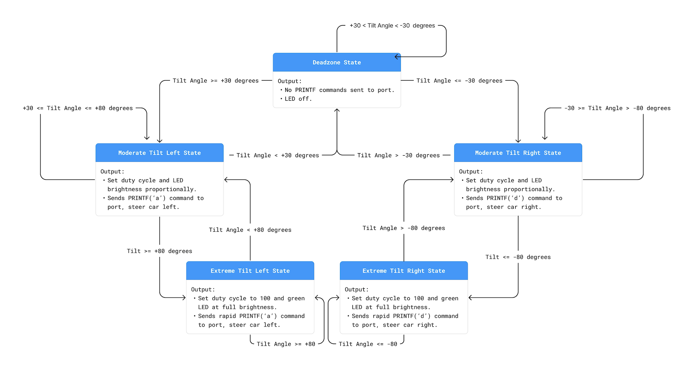

# FRDM ASCII Racer Controller

This project turns an FRDM microcontroller board into a handheld controller for [ASCII Racer](https://github.com/UpGado/ascii_racer), a terminal racing game that is normally played with a keyboard.

Instead of pressing `w`, `a`, `s`, and `d` on the keyboard, the player uses switches and board movement. Button presses control the car's speed, the accelerometer controls steering, and the reset switch starts a new race.

## Table of Contents

- [Demo](#demo)
- [The Game](#the-game)
- [How to Play](#how-to-play)
- [Quick Start](#quick-start)
- [How It Works](#how-it-works)
- [Controller Details](#controller-details)
- [Repository Layout](#repository-layout)
- [Outside Resources](#outside-resources)

## Demo

<video src="docs/media/demo.mp4" controls width="700" style="max-width: 100%; height: auto;">
  If embedded video is not supported, view the demo at `docs/media/demo.mp4`.
</video>

## The Game



ASCII Racer is an endless racing game where the player steers a car through a terminal window. The goal is to collect positive-score items and avoid penalties while controlling the car's speed.

| Item | Points |
| --- | ---: |
| Vodka | 10 |
| Gin | 10 |
| Dollar sign | 1 |
| Beer | -5 |

The score and elapsed time appear in the upper-left corner of the terminal. The speedometer appears on the right.

<br clear="right">

## How to Play

<table>
  <tr>
    <td valign="top" width="60%">
      <p>The FRDM board replaces the keyboard controls with physical inputs:</p>
      <table>
        <thead>
          <tr>
            <th>Board control</th>
            <th>Game action</th>
          </tr>
        </thead>
        <tbody>
          <tr>
            <td>SW1 / Switch 1</td>
            <td>Accelerate</td>
          </tr>
          <tr>
            <td>SW3 / Switch 3</td>
            <td>Decelerate</td>
          </tr>
          <tr>
            <td>Accelerometer</td>
            <td>Steer left or right by tilting the board</td>
          </tr>
          <tr>
            <td>Built-in green LED</td>
            <td>Shows how strongly the board is being tilted</td>
          </tr>
          <tr>
            <td>Reset switch</td>
            <td>Starts a new game session</td>
          </tr>
          <tr>
            <td>Peripheral LED / LED0</td>
            <td>Shows a red, red, green startup sequence</td>
          </tr>
        </tbody>
      </table>
      <p>Hold the board vertically with the black zigzag closest to you. Tilt the board left or right to steer. A stronger tilt makes the built-in green LED brighter.</p>
    </td>
    <td valign="top" width="40%" align="center">
      
    </td>
  </tr>
</table>

## Quick Start

1. Download this repository as a zip file and extract it.
2. Build and flash the FRDM board using the `ascii_racer_controller` directory.
3. Confirm that the serial port in `py_serial.py` matches the connected board.
4. From the repository root, make the setup script executable and run it:

   ```sh
   chmod +x setup_mac.sh
   ./setup_mac.sh
   ```

5. When prompted, enter the path to the downloaded repository.
6. Press the reset switch on the board and wait for the startup light to turn green.

## How It Works

The project has three main parts:

1. The FRDM controller firmware reads the board's switches, accelerometer, reset input, and LEDs.
2. The board sends simple serial messages to the computer.
3. `py_serial.py` listens for those messages and turns them into keyboard input for ASCII Racer.

<p align="center">
  
</p>

The board communicates with the computer at 115200 baud. Each control sends a short command that the Python script maps to a game action:

| Serial command | Game action                                |
| -------------- | ------------------------------------------ |
| `w`            | Accelerate                                 |
| `s`            | Decelerate                                 |
| `a`            | Steer left                                 |
| `d`            | Steer right                                |
| `asciiracer`   | Start a fresh ASCII Racer terminal session |

## Controller Details

### Switches

<p align="center">
  
</p>

The two board switches control speed. Switch 1 sends `w` to accelerate, and Switch 3 sends `s` to decelerate.

### Accelerometer

<p align="center">
  
</p>

The accelerometer reads the board's left-right tilt. Small tilts stay in a dead zone so the car can keep moving straight. Larger tilts send steering commands, and the built-in green LED gets brighter as the tilt increases.

| Tilt range               | Game response             | LED response                |
| ------------------------ | ------------------------- | --------------------------- |
| Greater than +80 degrees | Sharp steering command    | Full brightness             |
| +30 to +80 degrees       | Moderate steering command | Brightness scales with tilt |
| -30 to +30 degrees       | No steering command       | Off                         |
| -80 to -30 degrees       | Moderate steering command | Brightness scales with tilt |
| Less than -80 degrees    | Sharp steering command    | Full brightness             |

To keep steering smooth, the Python script only turns every eighth accelerometer message into a keyboard press.

### Reset Switch and Peripheral LED

The reset switch sends `asciiracer` to the Python script. The script closes the current game session if one is running, opens a new Terminal window named `ASCII Racer`, and starts a new race.

The peripheral LED also runs a red, red, green startup sequence. The green light signals that the race is ready to begin.

## Repository Layout

```text
.
├── ascii_racer_controller/   # FRDM controller firmware project
├── asciiracer/               # Local copy of the ASCII Racer game
├── docs/images/              # README images and diagrams
├── docs/media/               # README demo video
├── py_serial.py              # Serial-to-keyboard bridge
├── setup.py                  # Python package setup
└── setup_mac.sh              # macOS setup and launch script
```

## Outside Resources

This project builds on [ASCII Racer](https://github.com/UpGado/ascii_racer), an Atari-inspired terminal racing game by Dio Gado / UpGado.

You can read more about the original game in [The Tale of ASCII Racer](https://upgado.com/2019/08/31/tale-of-ascii-racer.html).
